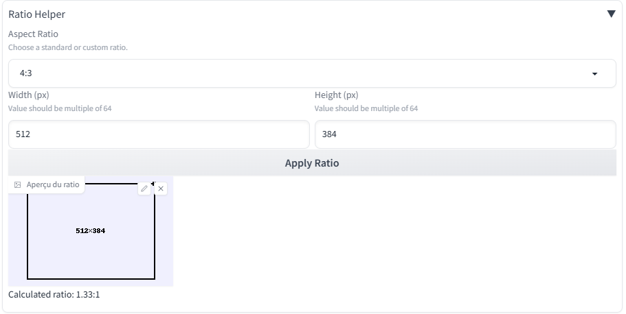

# 📐 SD Aspect Ratio Helper

**Aspect Ratio Helper** est une extension pour [AUTOMATIC1111 Stable Diffusion WebUI](https://github.com/AUTOMATIC1111/stable-diffusion-webui) qui vous permet de définir facilement les dimensions de génération à partir d’un ratio standard, avec un calcul automatique et un aperçu visuel interactif.

---

## ✨ Fonctionnalités

- 🔢 Choix d’un ratio dans une liste de formats standards :
  - `1:1`, `4:3`, `3:2`, `16:9`, `2:3`, `3:4`, `5:4`, `7:5`, `9:16`, `4:5`, `6:7`
  - Formats papier : `8.5x11`, `11x14`, `A4`, `A3`
- 🧠 Calcul automatique de la largeur ou de la hauteur selon le ratio sélectionné
- ✅ Dimensions alignées automatiquement sur des multiples de 64
- ⚠️ Alerte si dimensions < 256 px
- 🔄 Synchronisation automatique avec les champs principaux de génération (Width / Height)
- 🖼️ Aperçu visuel dessiné dynamiquement :
  - Taille centrée
  - Fond coloré selon l’orientation
  - Icône d’orientation (`H` ou `V`)
  - Cadre en pointillés
- 🌍 Interface multilingue (auto-détection de la langue WebUI) :
  - 🇫🇷 Français
  - 🇬🇧 English
  - 🇩🇪 Deutsch
  - 🇪🇸 Español
  - 🇵🇹 Português
  - 🇸🇦 العربية

---

## 📸 Aperçu de l’interface

> Exemple dans l’onglet `txt2img` de la WebUI.

---

## 📦 Installation

1. Copiez ce dossier dans les extensions
